# Установка Rust

Для работы с Rust вам понадобится, непосредственно, Rust тулчейн (компилятор, система сборки и т.д.), а так же стандартная библиотека Си и компоновщик (линкер).

Необходимость стандартной библиотеки Си обусловлена тем, что для операции выделения памяти, а так же для некоторых операций копирования, Rust использует Сишные функции.

(Начиная с Rust 1.90, LLD должен стать линкером по умолчанию для Linux x64).

## rustup

Установка Rust тулчейна осуществялется при помощи официальной утилиты `rustup`.

[https://www.rust-lang.org/tools/install](https://www.rust-lang.org/tools/install)

В зависимости от того, какую операционную системы вы используете, процесс установки через `rustup` будет отличаться, так как на Windows, Linux и MacOS линкер и стандартная библиотека Си устанавливаются по разному.

## Установка на Windows

Для установки Rust тулчейна на Windows, как и для Linux, так же требуется стандартная библиотека Си и линкер. На данный момент, на выбор есть два варианта:

* Установить Microsoft Visual C++, которая помимо всего прочего включает в себя и стандартную библиотеку Си, и линкер.\
  Этот способ быстрее и удобнее, но требует больше дискового пространства.\
  Рекомендуется для тех, кто устанавливает Rust впервые, при этом не имеет опыта программирования на Си++ под Windows.
* установить MinGW, которая включает в себя порт GCC под Windows, который в свою очередь содержит стандртную библиотеку Си и линкер.\
  Этот способ менее дружественный для новичков, но требует заметно меньше места на диске.

### Установка Microsoft Visual C++

Мы предполагаем, что у вас еще не установлена Visual Studio

1\) Сначала нам потребуется скачать rustup-init.exe c [https://rust-lang.org/tools/install/](https://rust-lang.org/tools/install/)

<figure><figcaption></figcaption></figure>

2\) Запускаем инсталятор. Должна открыться такая консоль:

<figure>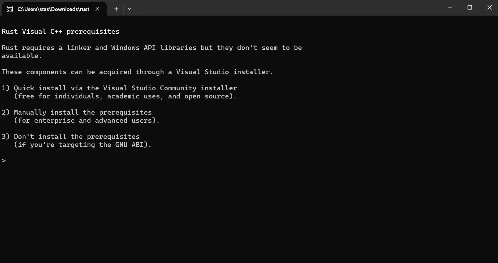<figcaption></figcaption></figure>

3\) Выбираем опцию номе 1 - автоматическая установка Visual Studio Community.

<figure>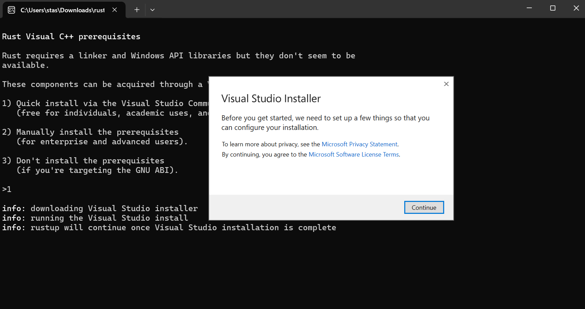<figcaption></figcaption></figure>

Инсталятор предлогает установить компонент C++ тулчейн: комплятор, C и C++ библиотеки, а так же линкер. Для работы линкера еще потребуется компонент Windows SDK, который мы потом установим отдельно.&#x20;

<figure>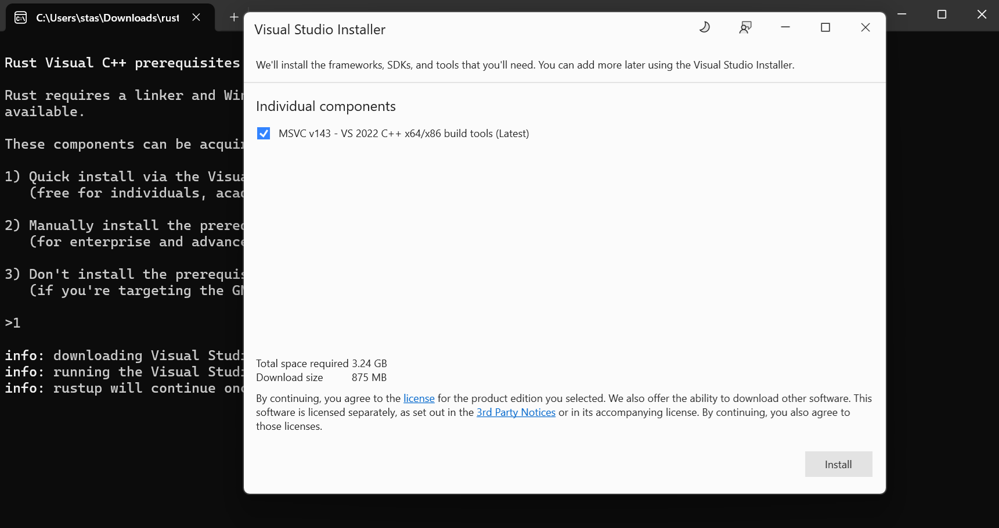<figcaption></figcaption></figure>

4\) После установки Visual C++, установщик Rust тулчейна покажется следующую информацию, где будет указано, что будет установлен тулчейн x86\_64-pc-windows-msvc (или arm).\
Выбирем 1-й вариант (просто установить тулчейн с настроками по-умолчанию).

<figure><figcaption></figcaption></figure>

&#x20;После установки компонентов Rust тулчейна, это окно косоли можно закрывать.

<figure><figcaption></figcaption></figure>

5\) Теперь надо установить недостающий Visual Studio компонент — Windows SDK.\
Вам нужно запустить инсталятор Visual Studio компонентов. По умолчанию он должен быть установлен в `C:\Program Files (x86)\Microsoft Visual Studio\Installer\setup.exe`.

<figure>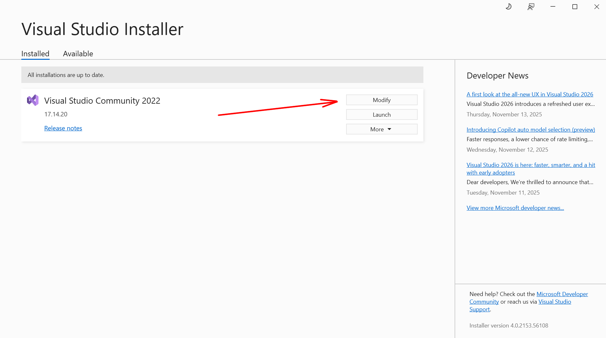<figcaption></figcaption></figure>

Нажимаем на "Modify" и выбираем компонент Windows SDK для вашей версии Windows.

<figure>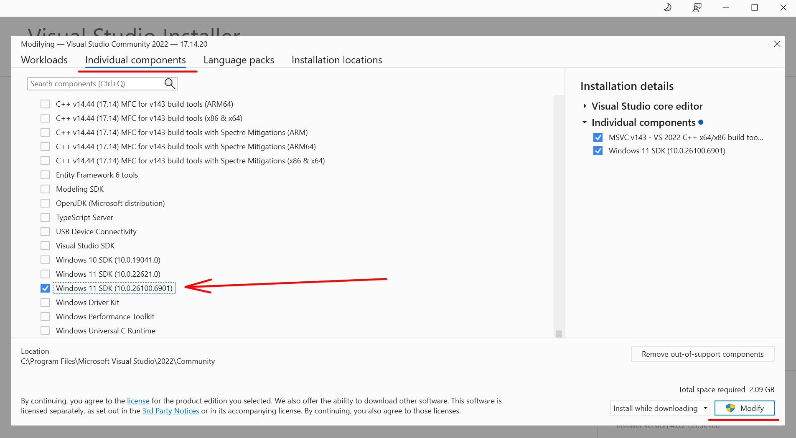<figcaption></figcaption></figure>

После жмём "Modify". Теперь все необходимые компоненты должны быть установлены.

6\) Перезагрузите Windows (он это любит).

7\) Теперь надо проверить, что всё работает. Откройте консоль (PowerShell или cmd).\
Создайте отдельную директорию (для удобства), например `projects`.

```
mkdir projects
```

Перейдите в эту директорию

```
cd projects
```

Теперь создайте новый Rust проект при помощи утилиты cargo.

```
cargo new test_rust
```

(Cargo, как и другие утилиты Rust тулчейна, должны были быть установлены при помощи rustup).

<figure>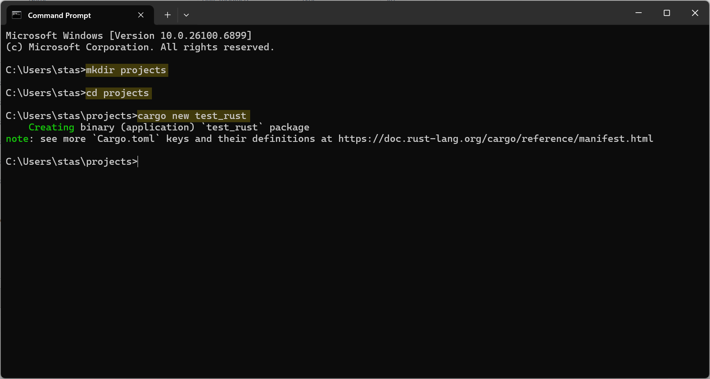<figcaption></figcaption></figure>

После этого в вашей домашней директории должен появится каталог `projects`, внтури которого должен находится каталог `test_rust`.

Каталог `test_rust` содержит "болванку" консольного приложения на Rust, которое просто печатает на консоль строку "Hello, world!". Давайте скомпилируем и запустимэто приложение, чтобы убедиться, что все компоненты тулчейна установлены и работают коректно.

Для этого в консоли перейдите в каталок test\_rust и выполните команду `cargo run`.

<figure>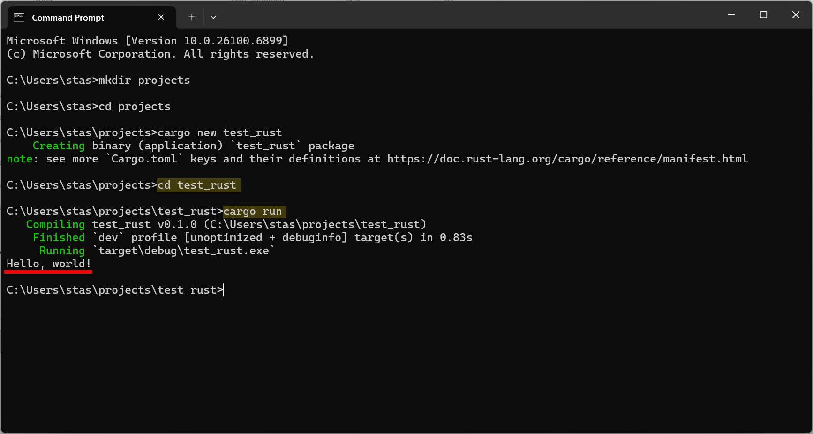<figcaption></figcaption></figure>

Всё готово.

#### Ошибка: link.exe не найден

Если вмето "Hello, world!" команда `cargo run` напечатала следующее:

<figure>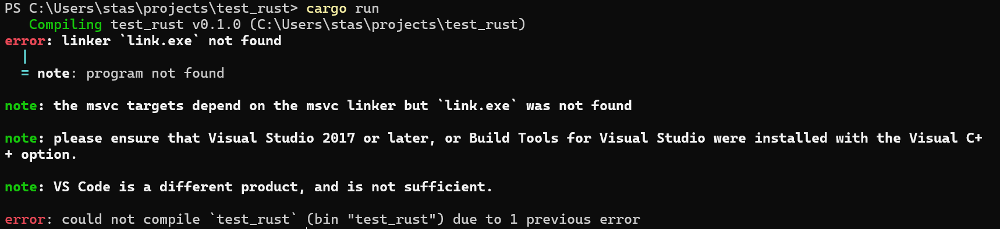<figcaption></figcaption></figure>

то значит по какой-то причине, установщик Visual Studio не добавил путь к каталогу содержащий линкер в системные пути. Нам придётся сделать это вручную.

1\) Перейдите в каталог, в который была установлена Visual Studio.\
По умолчанию это: `C:\Program Files\Microsoft Visual Studio`

2\) Далее перейдите в подкаталог\
`РЕДАКЦИЯ\Community\VC\Tools\MSVC\ВЕРСИЯ\bin`\
где РЕДАКЦИЯ — версия редакции Visual Studio (на помент написания этого текста, последняя была редакция 2022), а ВЕРСИЯ — версия компонента Microsoft Visual C++ (например `14.44.35207`).

3\) Далее перейдите в каталог который начинается с `Host`, а дальше содержит архитектуру вашего процессона. Например, если у вас 64-разрядный прцоессор от Intel или AMD, то вам нужен каталог `Hostx64`.

И снова перейдите в подкатало с названием архитектуры вашего прцоессора. Например `x64`.

Таким образом полный путь, должен быть похож на:

```
C:\Program Files\Microsoft Visual Studio\2022\Community\VC\Tools\MSVC\14.44.35207\bin\Hostx64\x64
```

Убедитесь, что в этом каталоге есть файл `link.exe`.

4\) Теперь, добавляем путь к этому каталогу в переменную окружения Path.

Вам понадобится компнонет для редактирования переменных системного кружения из панели управления.

<figure>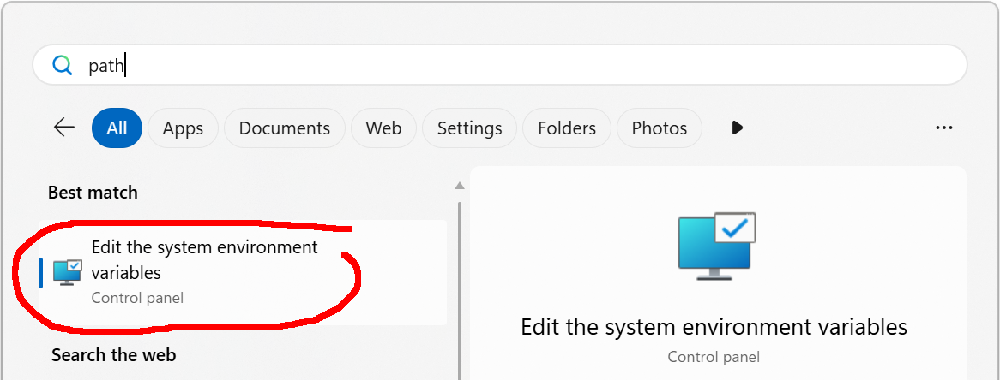<figcaption></figcaption></figure>

Нажмите на кнопку "Environment Variables...".

<figure>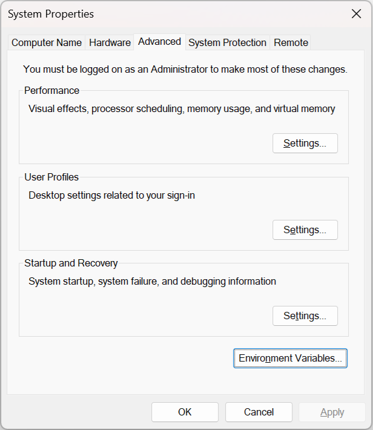<figcaption></figcaption></figure>

В появившемся окне выберите строку с переменной "Path" и нажмите кнопку "Edit".

<figure>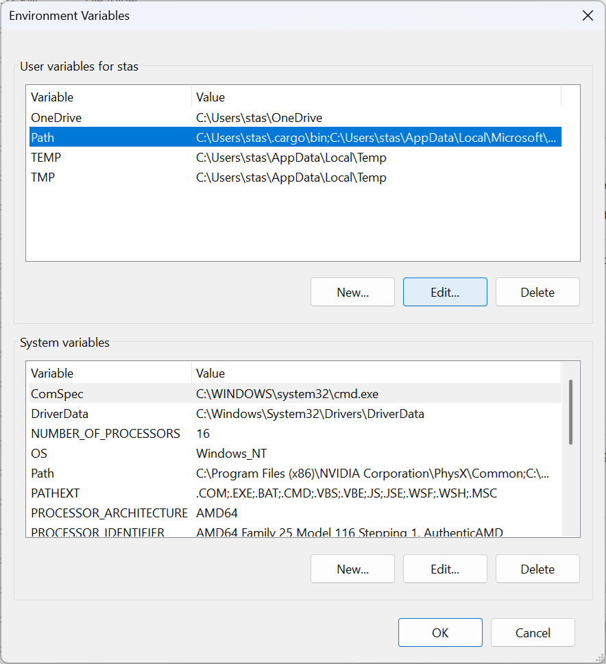<figcaption></figcaption></figure>

Во всплывшем окне нажмите кнопку "New" и добавьте путь к директории, которая содержит файл `linker.exe`.

<figure>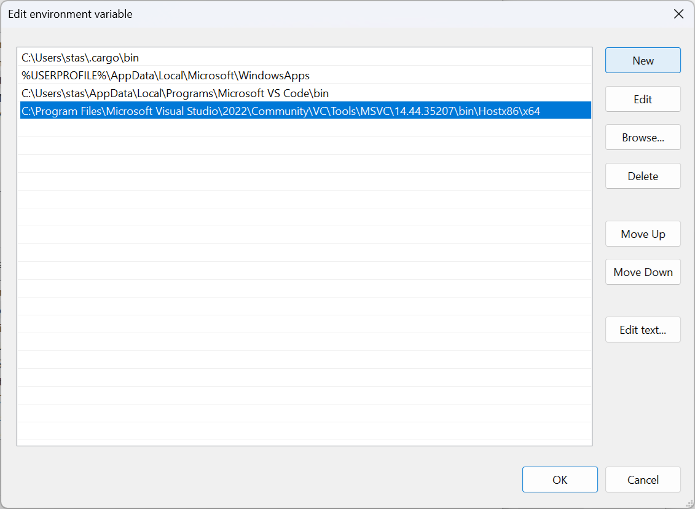<figcaption></figcaption></figure>

Нажмите "Ok", потом "Ok" и снова "Ok".

Теперь откройте **новую** консоль, снова перейдите в каталог `projects\test_rust`, и выполните команду `cargo run`.

### Установка MinGW

TODO: расписать подробнее

Наиболее просто способ установки - через msys.

1\) Установить MSYS: [https://www.msys2.org/](https://www.msys2.org/)

2\) Открыть msys консоль и установить пакеты `mingw` и `base-develop`

```
pacman -S mingw-w64-x86_64-toolchain
pacman -S base-devel
```

3\) Скачать rustup для Windows: [https://static.rust-lang.org/rustup/dist/x86\_64-pc-windows-gnu/rustup-init.exe](https://static.rust-lang.org/rustup/dist/x86_64-pc-windows-gnu/rustup-init.exe)

4\) Запустить.

Отказаться от автоматической установки Visual Studio, вместо этого выбрать ручную установку необходимых компонентов.

Далее вместо `x86_64-pc-windows-msvc` выбрать `x86_64-pc-windows-gnu` и завершить установку.

## Установка на Linux

Для начала установите GCC, если он еще не установлен. В различных дистрибутивах это делается по-розному, но как правило при помощи пакетного менеджера. В дистрибутивах Linux основанных на Ubuntu, GCC устанавливается командой:

```
sudo apt install gcc
```

После того как GCC установлен, следуйте инструкциям на [https://www.rust-lang.org/tools/install](https://www.rust-lang.org/tools/install)

На момент написания этого текста, официальное руководство `rustup`, указывает выполнить комманду:

```
curl --proto '=https' --tlsv1.2 -sSf https://sh.rustup.rs | sh
```

Эта комманда выкачает и запустит скрипт `rustup.sh`, который, в свою очеред, скачает Rust тулчей и поместит в каталог `~/.rustup` .

Выполните команду `rustc --version`, которая печатает версию текущего установленного компилятора Rust. Если всё прошло успешно, то вывод должен быть приметно таким:

```
$ rustc --version
rustc 1.89.0 (29483883e 2025-08-04)
```
