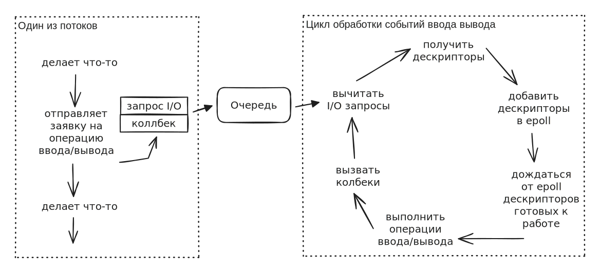

# Установка Rust

Для работы с Rust вам понадобятся как минимум:

* Rust тулчейн (компилятор, система сборки и т.д.) — для комплияции файлов с исходным кодом на Rust в объектные файлы (файлы с машинным кодом)
* Линкер (компоновщик) — для сборки множества объектных файлов в исполняемый файл программы
* Стандартная библиотека C

Необходимость стандартной библиотеки C обусловлена тем, что для операции выделения памяти, а так же для некоторых операций копирования, Rust использует Сишные функции.

Сборка прикладной программы на Rust выглядит примерно так:

То есть при сборке финального исполняемого файла из скомпилированных модулей, линкеру должна быть доступна стандартная библиотека C.

***

Установка Rust тулчейна осуществялется при помощи официальной утилиты `rustup`.

[https://www.rust-lang.org/tools/install](https://www.rust-lang.org/tools/install)

В зависимости от того, какую операционную системы вы используете, процесс установки через `rustup` будет отличаться, так как на Windows, Linux и MacOS линкер и стандартная библиотека Си устанавливаются по разному.

Далее мы отдельно рассмотрим устанновку Rust на Windows и Linux.
